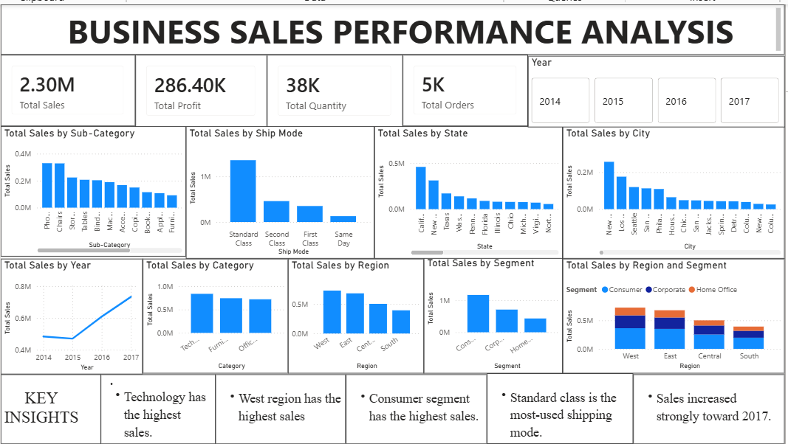

# Business Sales Performance Analysis

## Project Overview

This project analyzes business sales data using Power BI to understand sales performance across different categories, regions, segments, cities, states, and shipping modes.

The dashboard provides an interactive view of key business metrics and helps identify important sales trends and patterns.

## Tools & Technologies

- Power BI
- Data Visualization
- Data Analysis
- Excel / CSV Dataset

## Key Performance Indicators

- Total Sales: 2.30M
- Total Profit: 286.40K
- Total Quantity: 38K
- Total Orders: 5K

## Dashboard Features

The dashboard includes:

- Total Sales by Sub-Category
- Total Sales by Ship Mode
- Total Sales by State
- Total Sales by City
- Total Sales by Year
- Total Sales by Category
- Total Sales by Region
- Total Sales by Segment
- Total Sales by Region and Segment
- Year-wise filtering using a slicer

## Key Insights

- Technology has the highest sales among the categories.
- The West region has the highest sales.
- The Consumer segment has the highest sales.
- Standard Class is the most-used shipping mode.
- Sales increased strongly toward 2017.

## Dashboard Preview

## Project Files

- `Business_Sales_Performance_Analysis.pbix` - Power BI dashboard file
- `Dashboard.png` - Dashboard screenshot
- `README.md` - Project documentation

## Author

**Madhuri**
